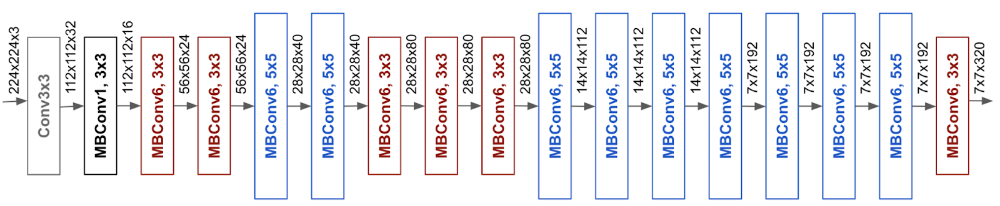

============
EfficientNet
============

Implementation of EfficientNet (https://arxiv.org/abs/1905.11946) based on https://github.com/zylo117/Yet-Another-EfficientDet-Pytorch. |br|
|br|
Basic Architecture of the baseline B0 network:

All other EfficientNet Models (The Compound Coefficient can be choosen between 0 and 7) are version of this model. Bigger models are scaled up by increasing both the
number of MBConvBlocks and the number of convolutional channels. |br|
Vortex uses EfficientNet as the Backbone of the cropping and the 2D pose estimation network.

.. automodule:: lib.hybridnet.modules.efficientnet.model
    :members:
    :exclude-members: forward
.. automodule:: lib.hybridnet.modules.efficientnet.utils
    :members:
    :exclude-members: forward, GlobalParams, BlockArgs

.. toctree::
    :maxdepth: 2

.. |br| raw:: html

       
