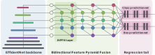

==============
EfficientTrack
==============

Implementation of EfficientTrack based on https://github.com/zylo117/Yet-Another-EfficientDet-Pytorch and https://github.com/HRNet

.. automodule:: lib.hybridnet.modules.efficienttrack.model
    :members:
    :exclude-members: forward
.. automodule:: lib.hybridnet.modules.efficienttrack.utils
    :members:
    :exclude-members: forward
.. automodule:: lib.hybridnet.modules.efficienttrack.loss
    :members:
    :exclude-members: forward
.. automodule:: lib.hybridnet.modules.efficienttrack.efficienttrack
    :members:
    :exclude-members: forward

.. toctree::
    :maxdepth: 2
